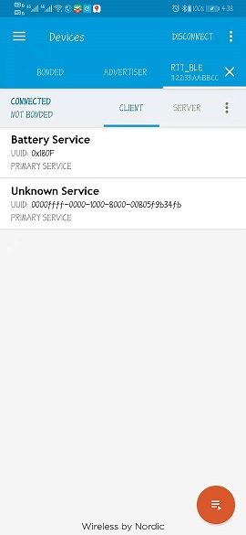

# BSAL

## 1.  BSAL 软件包介绍

BSAL （Bluetooth Stack Abstract Layer）软件包是由 RT-Thread 针对不同 蓝牙协议栈接口实现的，目前支持的 协议栈有：nimble，realtek 等协议栈。

> 提示：目前支持芯片为 Realtek 和 Nordic，若在其他芯片上使用该软件包，编译将通不过。

### 1.1 背景介绍

Bluetooth Stack Abstract Layer 蓝牙协议栈抽象层。用于适配各家协议栈以及底层卡片。

主要在协议栈基础之上封装一层抽象层接口。

## 2. BSAL 使用说明

BSAL 配置如下图所示：

选择需要生成的角色（默认选择 Peripheral 即可）：

- Peripheral role:
- Central role
- Broadcaster role
- Observer role

选择不同的示例可以实现不同的 APP 功能：

- Battery service     单 battery servcie 测试 sample
- battery and blufi service  两个 profile servic（blufi 配网， bas）测试 sample

再选择对应的协议栈：

- nimble   （nimble 协议栈适配层）
- realtek  （realtek 协议栈适配层）
- empty_stack   （移植协议栈模板）

## 3. BSAL 依赖

BSAL 依赖对应的协议栈，比如 nimble，需要先有 nimble+RTT 的 sample 工程，首先确保可以跑对应协议栈的原生的 sample。再试着添加 BSAL 层跑 sample

每个 sample 对应一个 cmd：

- battery service： bsal_bas_app
- battery and blufi service： bsal_bas_blufi_app

输入对应的 cmd 即可。

## 4. 测试验证工具

输入 cmd bsal_bas_blufi_app 启动 sample

手机下载 nRF Connect 工具（apple 使用 lightblue）

[nRF Connect](https://github.com/NordicSemiconductor/Android-nRF-Connect/releases)

搜索广播看到如下界面：

点击 connect 连接上之后：

可以看到 battery service 和 0xffff 配网 blufi service，说明 sample 运行成功。

## 5. BSAL 入门指引

1. 如果没有蓝牙开发的经验，可以先学习一下基础知识：[supperthomas_wiki](https://supperthomas-wiki.readthedocs.io/en/latest/index.html#)

2. 简单入门 BSAL：[文档地址](https://github.com/WaterFishJ/Summer2021_docs/tree/master/%E7%AE%80%E5%8D%95%E5%85%A5%E9%97%A8BSAL)
3. bas_sample 分析：[文档地址](https://github.com/WaterFishJ/Summer2021_docs/blob/master/pca10056%E7%9A%84bsal%E5%B1%82bas_sample%E8%A7%A3%E6%9E%90/pca10056%E7%9A%84bsal%E5%B1%82bas_sample%E8%A7%A3%E6%9E%90.md)
4. BSAL 实现 HRS：[文档地址](https://github.com/WaterFishJ/Summer2021_docs/blob/master/bsal%E5%B1%82%E5%AE%9E%E7%8E%B0HRS/bsal%E5%B1%82%E5%AE%9E%E7%8E%B0HRS.md)

3. 蓝牙技术联盟的 SPEC：[链接地址](https://www.bluetooth.com/specifications/specs/)

4. UUID 列表：[链接地址](https://btprodspecificationrefs.blob.core.windows.net/assigned-values/16-bit%20UUID%20Numbers%20Document.pdf)